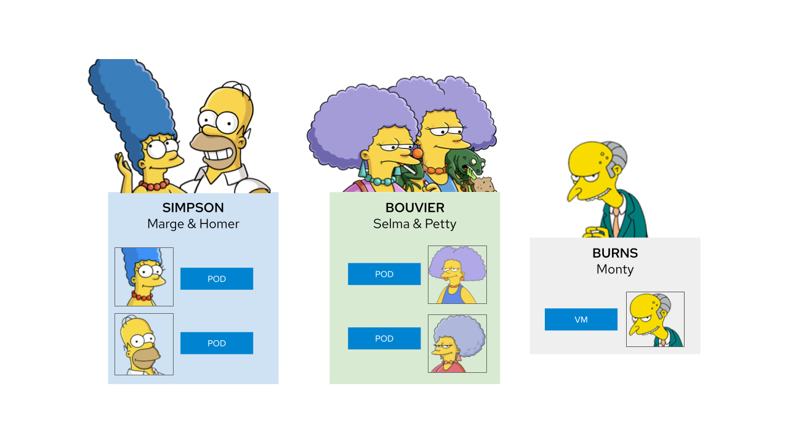
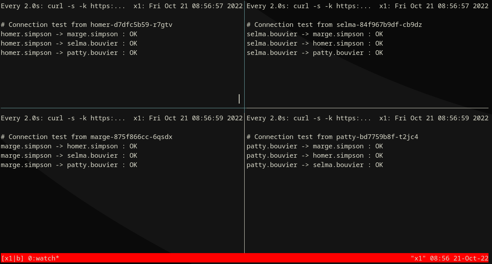
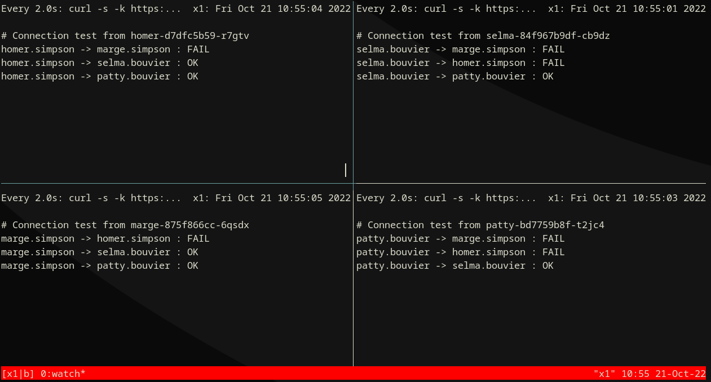
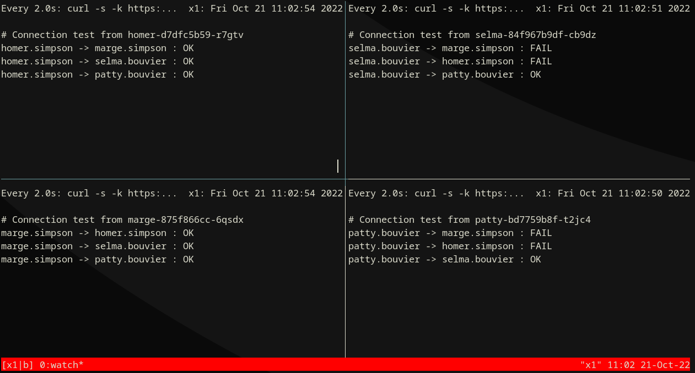
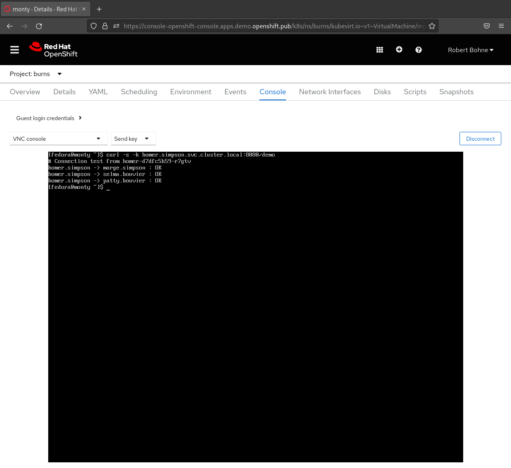

# Network Policy Demo

Official documentation: [About network policy
](https://docs.openshift.com/container-platform/latest/networking/network_policy/about-network-policy.html)


I presented this demo at the Next Generation Datacenter webinar, here the recording (in German)


<iframe width="560" height="315" src="https://www.youtube-nocookie.com/embed/n3cq7Ql0VSk" title="YouTube video player" frameborder="0" allow="accelerometer; autoplay; clipboard-write; encrypted-media; gyroscope; picture-in-picture" allowfullscreen></iframe>


## Environment



## Deploy Environment

=== "OC"

    ```
    oc apply -k https://github.com/openshift-examples/network-policy-demo.git/deployment/
    ```

## Optional: Deploy OpenShift Console samples

&nbsp;&nbsp;&nbsp;&nbsp;&nbsp;&nbsp;{ width="640" }

=== "OC"

    ```
    oc apply -f {{ page.canonical_url }}console-samples.yaml
    ```

=== "console-samples.yaml"

    ```yaml
    --8<-- "content/networking/network-policy/network-policy-demo/console-samples.yaml"
    ```


## Start Monitor

### Option 1) Local tmux script

```bash
curl -L -O {{ page.canonical_url }}run-tmux.sh

# Get OpenShift Wildcard domain:
WILDCARD_DOMAIN=$( oc get ingresscontroller/default -n openshift-ingress-operator -o jsonpath="{.status.domain}" )


# Start tmux
sh run-tmux.sh $WILDCARD_DOMAIN
```

&nbsp;&nbsp;&nbsp;&nbsp;&nbsp;&nbsp;{ width="640" }

### Option 2) via Pod 

=== "OC"

    ```
    oc apply -k https://github.com/openshift-examples/network-policy-demo.git/deployment/monitor/
    ```

Watch logs:

```bash
oc logs --tail=1 -f deployment/monitor -n network-policy-demo-monitor
```

## Step 1) Default deny


=== "OC"

    ```
    oc apply -f {{ page.canonical_url }}01_default-deny-simpson.yaml
    ```

=== "01_default-deny-simpson.yaml"

    ```yaml
    --8<-- "content/networking/network-policy/network-policy-demo/01_default-deny-simpson.yaml"
    ```


&nbsp;&nbsp;&nbsp;&nbsp;&nbsp;&nbsp;{ width="640" }

## Step 2) Allow ingress


=== "OC"

    ```
    oc apply -f {{ page.canonical_url }}02_allow-from-openshift-ingress-simpson.yaml
    ```

=== "02_allow-from-openshift-ingress-simpson.yaml"

    ```yaml
    --8<-- "content/networking/network-policy/network-policy-demo/02_allow-from-openshift-ingress-simpson.yaml"
    ```


&nbsp;&nbsp;&nbsp;&nbsp;&nbsp;&nbsp;{ width="640" }


## Step 3) Allow ingress


=== "OC"

    ```
    oc apply -f {{ page.canonical_url }}03_allow-same-namespace-simpson.yaml
    ```

=== "03_allow-same-namespace-simpson.yaml"

    ```yaml
    --8<-- "content/networking/network-policy/network-policy-demo/03_allow-same-namespace-simpson.yaml"
    ```


&nbsp;&nbsp;&nbsp;&nbsp;&nbsp;&nbsp;{ width="640" }


## Step 4) Allow from Bouviers to Marge Simpson


=== "OC"

    ```
    oc apply -f {{ page.canonical_url }}04_allow-from-bouviers-to-marge-simpson.yaml
    ```

=== "04_allow-from-bouviers-to-marge-simpson.yaml"

    ```yaml
    --8<-- "content/networking/network-policy/network-policy-demo/04_allow-from-bouviers-to-marge-simpson.yaml"
    ```


&nbsp;&nbsp;&nbsp;&nbsp;&nbsp;&nbsp;{ width="640" }


## Step 5) Allow from Burns to Simpson


=== "OC"

    ```
    oc apply -f {{ page.canonical_url }}05_allow-from-burns-simpson.yaml
    ```

=== "05_allow-from-burns-simpson.yaml"

    ```yaml
    --8<-- "content/networking/network-policy/network-policy-demo/05_allow-from-burns-simpson.yaml"
    ```


&nbsp;&nbsp;&nbsp;&nbsp;&nbsp;&nbsp;{ width="640" }


